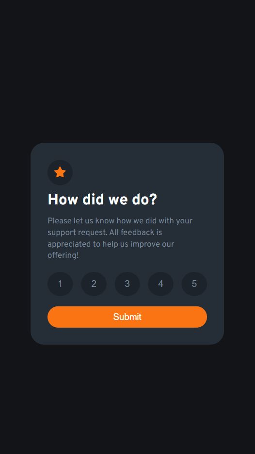
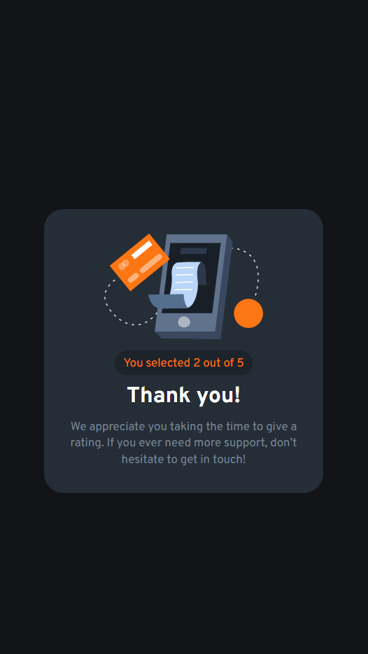

# Frontend Mentor - Interactive rating component solution

This is a solution to the [Interactive rating component challenge on Frontend Mentor](https://www.frontendmentor.io/challenges/interactive-rating-component-koxpeBUmI). Frontend Mentor challenges help you improve your coding skills by building realistic projects. 

## Table of contents

- [Overview](#overview)
  - [The challenge](#the-challenge)
  - [Screenshot](#screenshot)
  - [Links](#links)
- [My process](#my-process)
  - [Built with](#built-with)
  - [What I learned](#what-i-learned)
  - [Continued development](#continued-development)
- [Author](#author)

**Note: Delete this note and update the table of contents based on what sections you keep.**

## Overview
The Interactive rating component is a site that allow users to select a rating and submit. They would be a page to appreciate user and display the rating value they selected.

### The challenge

Users should be able to:

- View the optimal layout for the app depending on their device's screen size
- See hover states for all interactive elements on the page
- Select and submit a number rating
- See the "Thank you" card state after submitting a rating

### Screenshot






### Links

- Solution URL: [Add solution URL here](https://github.com/TRIPLE-ADE/react_rating_component)
- Live Site URL: [Add live site URL here](https://react-rating-site.netlify.app/)

## My process

### Built with

- Semantic HTML5 markup
- CSS custom properties
- Flexbox
- Mobile-first workflow
- [React](https://reactjs.org/) - JS library

### What I learned

Use this section to recap over some of your major learnings while working through this project. Writing these out and providing code samples of areas you want to highlight is a great way to reinforce your own knowledge.

To see how you can add code snippets, see below:

```html
<h1>Some HTML code I'm proud of</h1>
```
```css
*{
  margin: 0;
  padding: 0;
  box-sizing: border-box;
}
:root{
  --White: hsl(0, 0%, 100%);
  --Light-Grey: hsl(217, 12%, 63%);
  --Medium-Grey: hsl(216, 12%, 54%);
  --Dark-Blue: hsl(213, 19%, 18%);
  --Very-Dark-Blue: hsl(216, 12%, 8%);
  --orange:hsl(25, 97%, 53%);
  --AlphaBlue:hsla(216, 12%, 8%, 0.4);
  --font-family: 'Overpass', sans-serif;
}
html{
  font-size: 15px;
  font-family: var(--font-family);
}
```
```js
  const [value, setValue] = useState('')
  const [display, setDisplay] = useState(false)

  const handleClick = (event)=> {
    setValue(event.target.textContent)
  }
  const handleSubmit = () => {
   if(value !== ''){
    setDisplay(true)
   } 
  }
```

### Continued development

Use this section to outline areas that you want to continue focusing on in future projects. These could be concepts you're still not completely comfortable with or techniques you found useful that you want to refine and perfect.

- React Hook
- Higher order components
- State management

## Author

- Website - [Add your name here](https://github.com/TRIPLE-ADE/react_rating_component)
- Frontend Mentor - [@TRIPLE-ADE](https://www.frontendmentor.io/profile/TRIPLE-ADE)
- Twitter - [@Triple123A](https://www.twitter.com/Triple123A)


